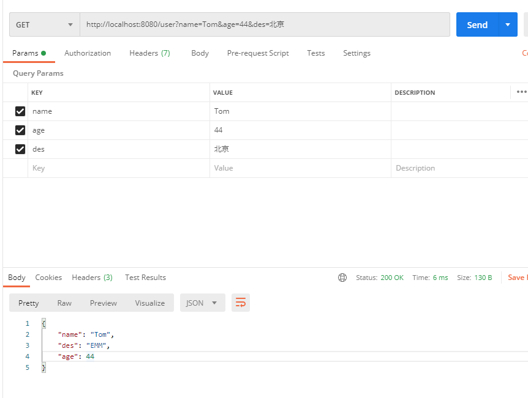
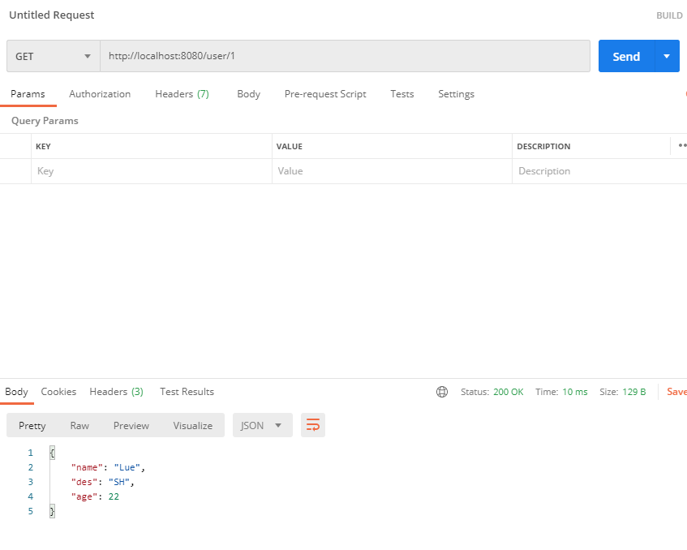
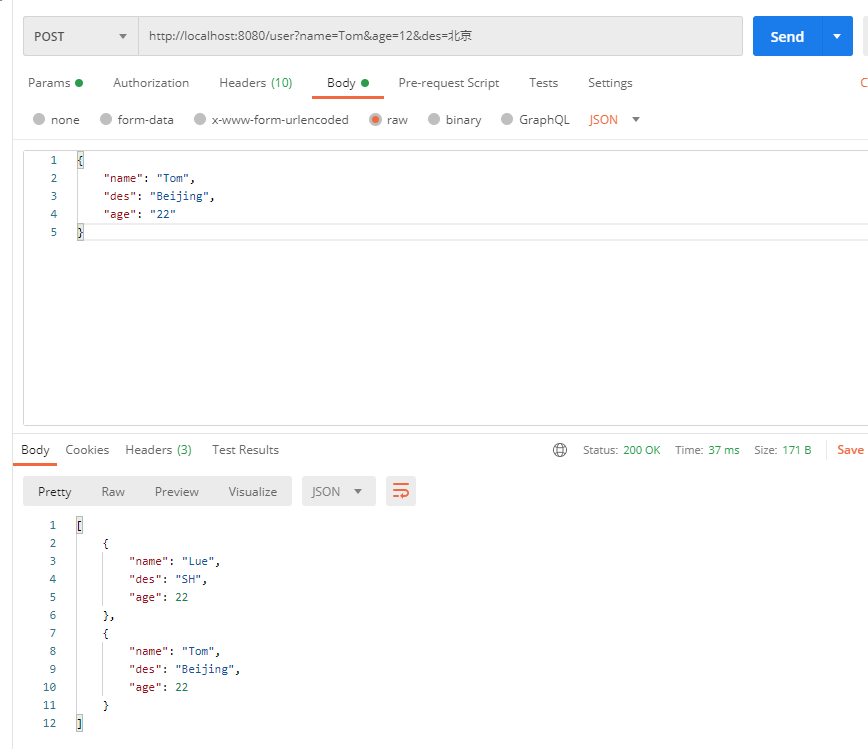

# simpleboot

## 介绍

simpleboot 是一个 模仿 Spring Boot 写的一个轻量级的 HTTP 框架。

### Get请求和POST请求处理

- [x] `@GetMapping` : 处理Get请求
- [x] `@PostMapping ` ：处理 Post 请求
- [x] `@RequestBody` : 接收前端传递给后端的json字符串
- [x] `@RequestParam` ：获取Get请求的 URL 查询参数
- [x] `@PathVariable` :  获取 URL 中的参数/占位符

### IOC

- [ ] `@Autowired`  ：注入对象
- [ ] `@Component ` ：声明对象被 IOC容器管理

### 异常处理

- [ ] `@ControllerAdvice` :
- [ ] `@ExceptionHandler` :

### 代码质量

- [x] 集成 checkstyle
- [x] 集成 spotbugs （*遇到了一点小坑，将gradle 版本升级为 6.6.1 解决*）


## 功能演示

**`User.java` ：用户实体类**

```java
@Data
@AllArgsConstructor
public class User {
    private String name;
    private String des;
    private Integer age;
}
```

**`UserDto.java` : 创建用户的传输对象**

```java
@Data
@AllArgsConstructor
@NoArgsConstructor
public class UserDto {
    private String name;
    private String des;
    private Integer age;
}
```

**`UserController.java`：用户层controller**

```java
@RestController("/user")
public class UserController {

    private static Map<Integer, User> users;
    private static Integer id;

    {
        users = new HashMap<>();
        users.put(1, new User("Lue", "SH", 22));
        id = 2;
    }
    @GetMapping
    public User get(@RequestParam("name") String name, @RequestParam("age") Integer age) {
        System.out.println(name);
        return new User(name, "EMM", age);
    }

    @GetMapping("/{id}")
    public User get(@PathVariable("id") Integer id) {

        return users.get(id);
    }

    @PostMapping
    public List<User> create(@RequestBody UserDto userDto) {
        users.put(id,new User(userDto.getName(), userDto.getDes(), userDto.getAge()));
        return new ArrayList<>(users.values());
    }

}
```

### Get 请求：@RequestParam 传参


### Get 请求：@PathVariable 传参


### Post 请求：@RequestBody 传参

